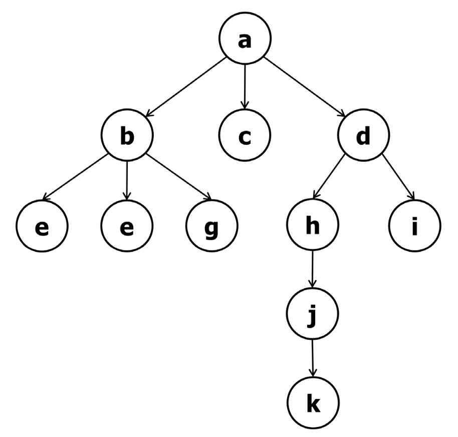
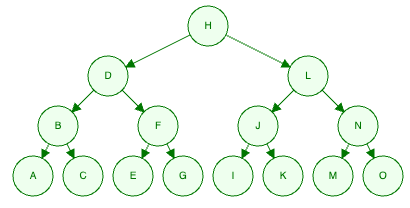
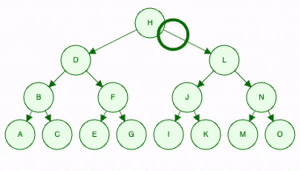
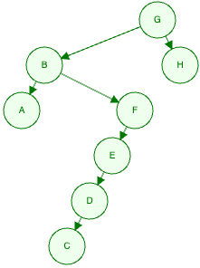
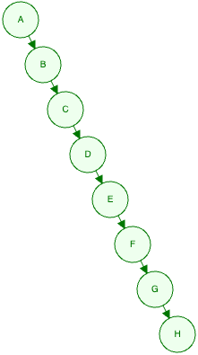

# 1 Bäume (allgemein): Begriffe und Merkmale

### a.) Welcher Knoten ist die Wurzel?
a

### b.) Listen Sie alle Knoten auf, welche Blätter sind.
e, e, g, c, k, i

### c.) Listen Sie alle inneren Knoten auf, welche Grade haben sie?
a=3, b=3, d=2, h=1, j=1

### d.) Auf welchem Niveau befindet sich der Knoten d?
1

### e.) Wie viele Knoten gibt es auf Niveau 2?
5

### f.) Welche Tiefe (Länge des Pfades) hat der Knoten j?
3

### g.) Wie hoch ist dieser Baum?
5

### h.) Können Sie eine Aussage zur Ordnung dieses Baumes machen?
mind. Ordnung 3

### i.) Ist dieser Baum ausgeglichen? Begründen Sie ihre Antwort.
Nein

# 2 Binäre Bäume: Begriffe und Merkmale 

### a.) Wie viele Wurzeln hat ein binärer Baum?
1 oder 0(leer)

### b.) Was hat ein binärer Baum für eine Ordnung?
2

### c.) Wie viele Niveaus benötigt ein binärer Baum im besten Fall für 31 Knoten? Wie berechnet sich dieser Wert?
2^5=32 

32-1=31 

5 Niveaus

### d.) Wie viele Niveaus ergeben sich im schlechtesten Fall? Wie berechnet sich dieser Wert?
31

### e.) Wie viele Knoten kann ein Binärbaum maximal je für die Niveaus 0 bis 5 enthalten?
Niveau 0 - 1

Niveau 1 - 2

Niveau 2 - 4

Niveau 3 - 8

Niveau 4 - 16

Niveau 5 - 32

### f.) Können Sie einen binären Baum mit insgesamt fünf Knoten entwerfen, welcher voll ist?

        4
      2   5
     1 3

### g.) Wie gross ist der Aufwand für die Suche nach einem Element in einem binären Baum im jeweils besten und jeweils schlechtesten Fall? Welche Szenarien sind das?

besten Fall -> ausgeglichen (balanciert) -> O(log n)

schlechtesten Fall -> nicht ausgeglichen -> 0(n)

# 3 Binäre Suchbäume: Suchen, Einfügen und Traversieren

### a.) Wir wollen 15 Datenelemente in einen binären Baum einfügen. Wie viele Niveaus benötigen wir dafür im besten Fall? Welchen Füllgrad hat dieser Baum somit?
4 Niveaus, Füllgrad: komplett

### b.) Fügen Sie die folgenden 15 Schlüsselelemente schrittweise und von Hand in einen leeren binären Baum ein: H D L B F J N A C E G I K M O

### c.) Suchen Sie im Baum von b) nach den folgenden Elementen: N, K und O.

### d.) Fügen Sie die folgenden 8 Schlüsselelemente ein einen neuen, leeren binären Baum ein: G H B F E A D C

### e.) Wie sieht ein binärer Baum aus, in welchen die folgenden Elemente eingefügt werden, und welcher Datenstruktur entspricht er somit? A B C D E F G H
Linkend List

### f.) Sie haben verschiedene Arten wie ein Baum traversiert werden kann kennengelernt. In welcher Art müssen Sie binäre Bäume traversieren, damit sie der Sortierung folgen?
Inorder

### g.) Überprüfen Sie ihre Antwort von f), indem Sie die Bäume der Teilaufgaben b), d) und e) entsprechend traversieren. Formulieren Sie dazu (in Pseudocode) eine Funktion mit einem rekursiven Algorithmus.
Ja

# 4 Modellierung: Datenstruktur für binären Suchbaum

