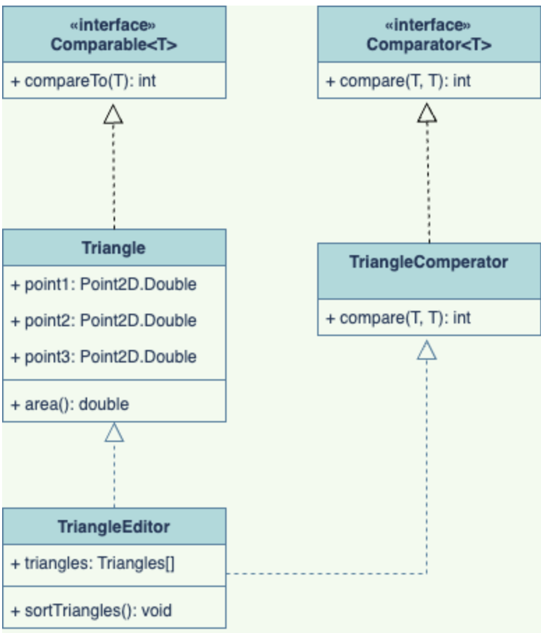
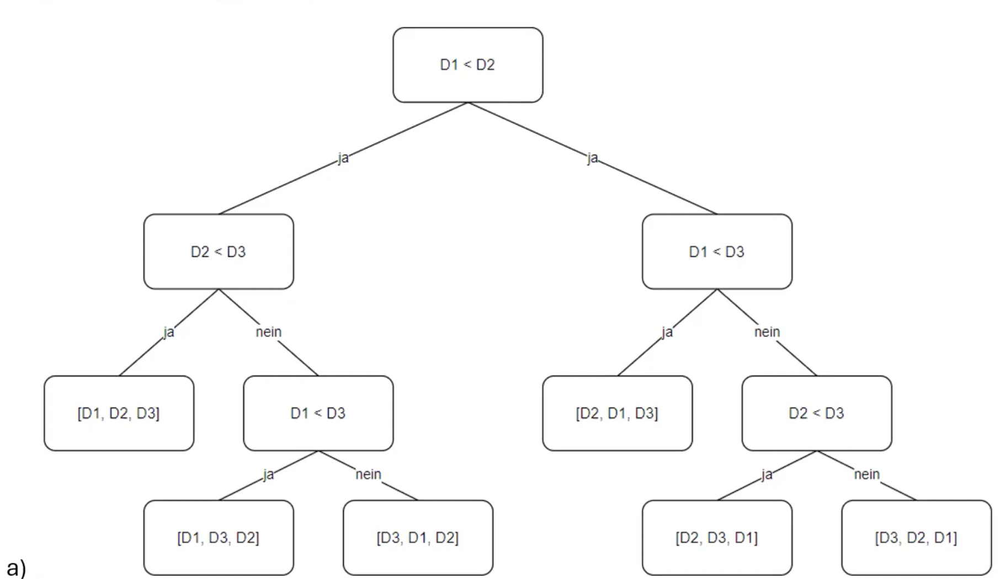

# 1 Grundlegende Zusammenhänge

a) Nach Fläche, Umfang..

b) Comparable<Triangle> mit int compareTo(Triangle t). 

c) in Triangle Klasse equals() und hashCode() überschreiben

d) Comparator mit compare()

e) 

# 2 Entscheidungsbaum

a)

b)
h ≥ log2(B)+1
4 ≥ 3.58

c)
h-1 = 3

# 3 Direktes Auswählen

b)
[w/1,g,w/2,e,h,a]

[a,g,w/2,e,h,w/1]

[a,e,w/2,g,h,w/1]

[a,e,g,w/2,h,w/1]

[a,e,g,h,w/2,w/1]

c)
Weil zum Ermitteln des kleinsten Schlüssels immer der komplette noch unsortierte Teil des Arrays durchlaufen werden muss, erübrigt sich hier im Prinzip eine Differenzierung in Best, Worst und Average Case!

f) 
0(n^2)