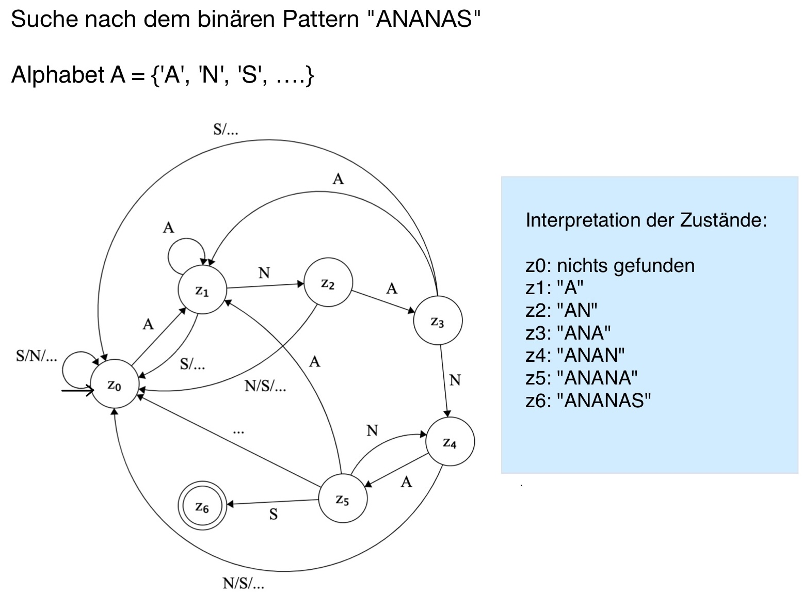
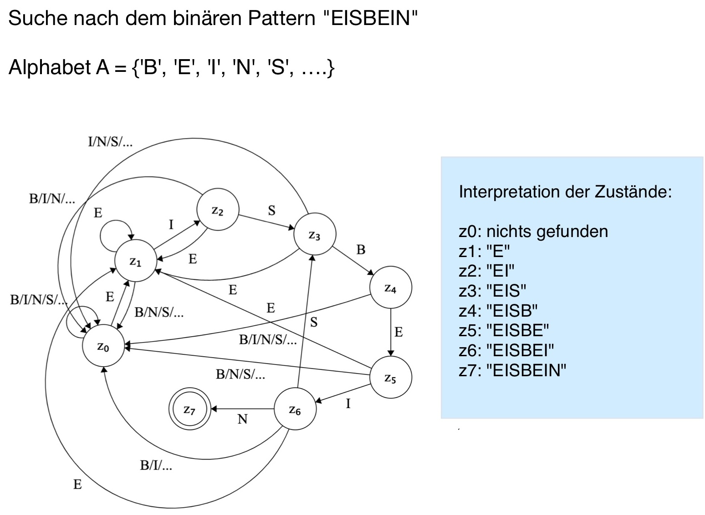
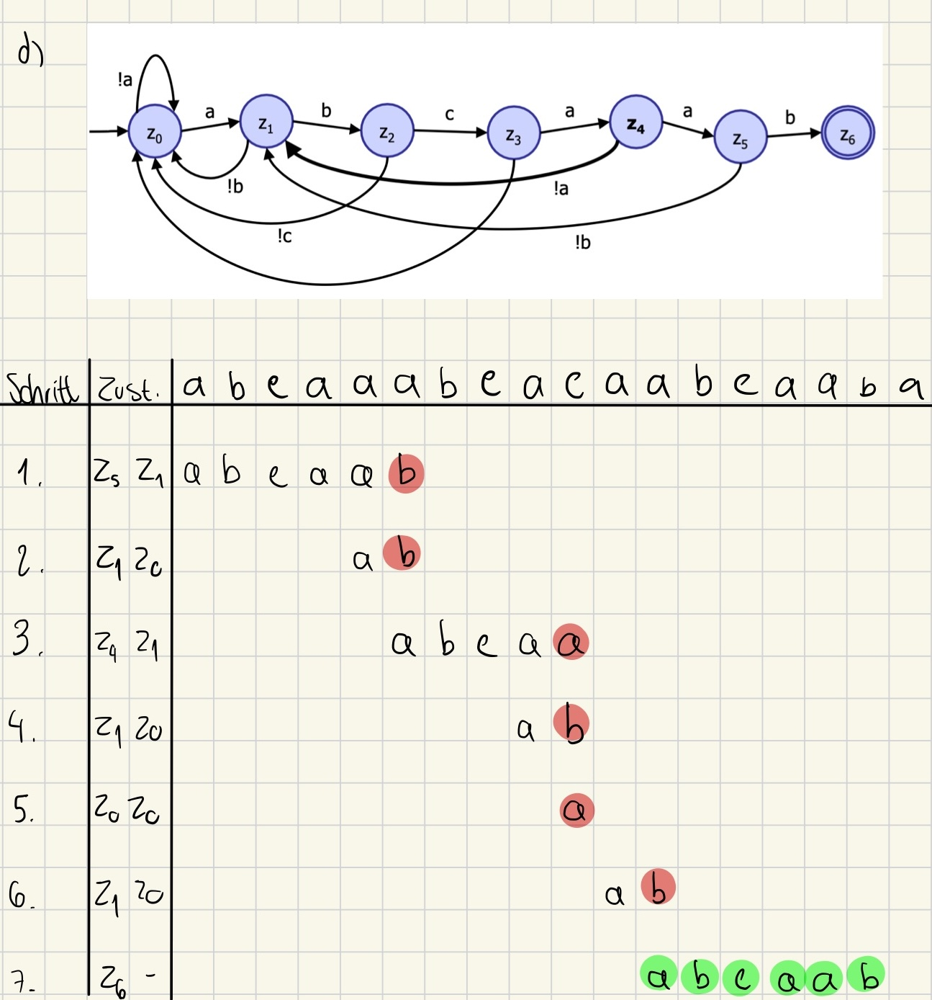
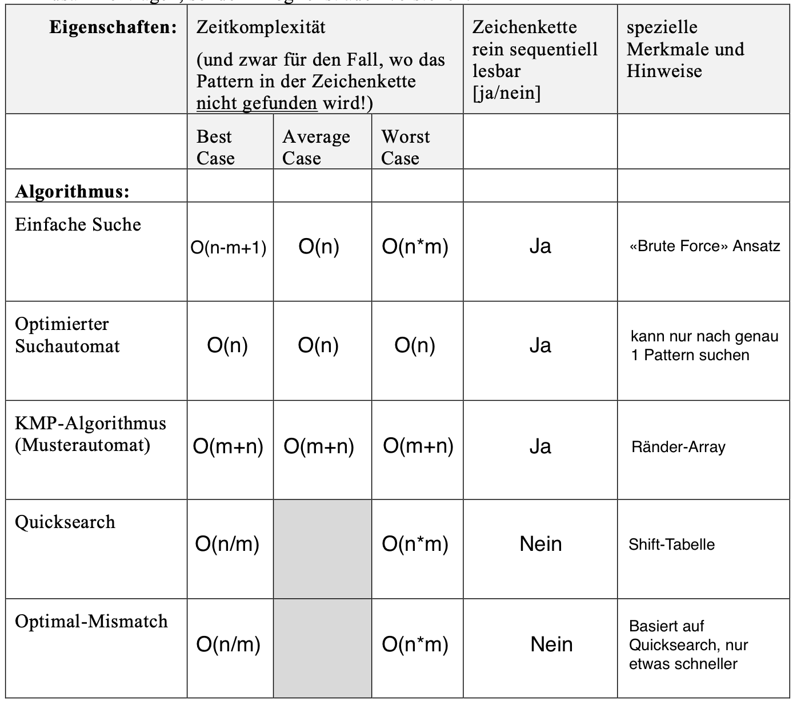

# 1 Einfache Suche

> Die Zeichenkette `aaaaaaaaaaaaaaaaaaaaa...a` mit `n = 100'000` soll mit Hilfe einer einfachen Suche nach einem Pattern der Laenge `m = 10` durchsucht werden.

 

#### a)

Pattern: `“aaaaaaaaaa”`, m=10

Zeichenvergleiche: 10

 

#### b)

Pattern: `“baaaaaaaaa“`

Zeichenvergleiche: 100’000

 

#### c)

Pattern: `“aaaaaaaaab”`

Zeichenvergleiche: (n−m+1) _ m = 99’991 _ 10 = 999'910

 

#### d)

- **Best case**: `O(m)`

- **Average case**: `O(n)`

- **Worst case**: `O(n*m)`

 
 

---

# 2 Optimierter Suchautomat

 

#### a)

- bei einer Unstimmigkeit muss die Suche nicht zwangslaeufig ganz von
  vorne begonnen werden.
- ein bereits gelesenes Zeichen muss nicht re-evaluiert werden.

 

#### b)

Zustaende: z0, z1, z2, z3, z4, z5, z6

Übergaenge:

(z0) --A--> (z1)

(z0) --N/S/...--> (z0)

---

(z1) --N--> (z2)

(z1) --A--> (z1)

(z1) --S/...--> (z0)

---

(z2) --A--> (z3)

(z2) --N/S/...--> (z0)

---

(z3) --N--> (z4)

(z3) --A--> (z1)

(z3) --S/...--> (z0)

---

(z4) --A--> (z5)

(z4) --N--> (z2)

(z4) --S/...--> (z0)

---

(z5) --S--> (z6)

(z5) --A--> (z1)

(z5) --N--> (z2)

(z5) --...--> (z0)

---

 

#### c)

Zustaende: z0, z1, z2, z3, z4, z5, z6, z7

Übergaenge:

(z0) --E--> (z1)

(z0) --B/I/N/S/...--> (z0)

---

(z1) --I--> (z2)

(z1) --E--> (z1)

(z1) --B/N/S/...--> (z0)

---

(z2) --S--> (z3)

(z2) --E--> (z1)

(z2) --B/I/N/...--> (z0)

---

(z3) --B--> (z4)

(z3) --E--> (z1)

(z3) --I/N/S/...--> (z0)

---

(z4) --E--> (z5)

(z4) --B/I/N/S/...--> (z0)

---

(z5) --I--> (z6)

(z5) --E--> (z1)

(z5) --B/N/S/...--> (z0)

---

(z6) --N--> (z7)

(z6) --E--> (z1)

(z6) --S--> (z3)

(z6) --B/I/...--> (z0)

---

 

#### d)

- Die Zustandsautomaten fuer diese Muster sind komplexer, da sie mehr Zustandsübergänge aufgrund der groesseren Alphabetgroesse haben.
- Da diese Muster mit einem groesseren Alphabet arbeiten, kann die Laufzeitkomplexitaet aufgrund der Vielzahl an Zustaenden und Uebergaengen hoeher sein

  
  

---

# 3 Musterautomat und KMP-Algorithmus

 

#### a)

| Teilwort | Zustand | Rand | Laenge | Folgezustand |
| :------- | :------ | :--- | :----- | :----------- |
| E        | z1      | -    | 0      | z0           |
| EI       | z2      | -    | 0      | z0           |
| EIS      | z3      | -    | 0      | z0           |
| EISB     | z4      | -    | 0      | z0           |
| EISBE    | z5      | E    | 1      | z1           |
| EISBEI   | z6      | EI   | 2      | z2           |
| EISBEIN  | z7      | -    | 0      | z0           |

 

#### b)

 

#### c)

| Teilwort | Zustand | Rand | Laenge | Folgezustand |
| :------- | :------ | :--- | :----- | :----------- |
| A        | z1      | -    | 0      | z0           |
| AN       | z2      | -    | 0      | z0           |
| ANA      | z3      | A    | 1      | z1           |
| ANAN     | z4      | AN   | 2      | z2           |
| ANANA    | z5      | ANA  | 3      | z3           |
| ANANAS   | z6      | -    | 0      | z0           |

 

#### d)

 

#### e)

Ananas: `[ -1, 0, 0, 1, 2, 3 ]`

Eisbein: `[ -1, 0, 0, 0, 0, 1, 2 ]`

 
 

---

# 4 Quicksearch

 

#### a)

- Die Länge des Shift-Arrays ergibt sich aus der Anzahl der möglichen Zeichen im Alphabet.
  - Als Index verwendet man direkt den Wert des ASCII-/Unicodes: Grösse der shift-Tabelle 256/65’536.
- Die Zahlenwerte im Shift-Array liegen im Bereich von 0 bis zur maximalen Verschiebung (`m+1`), die bei einem Mismatch auftreten kann.

 

#### b)

| 1   | 5   | 5   | 5   | 5   | 5   | 2   | 5   | 5   |
| --- | --- | --- | --- | --- | --- | --- | --- | --- |
| a   | b   | c   | d   | e   | f   | g   | h   | i   |

 

#### c)

#### - extrem schnell durch eine Zeichenkette "springt" bzw.

<table>
  <tr>
    <th>Zeichenkette</th>
    <td>abcdefghijklmnop</td>
  </tr>
  <tr>
    <th>Pattern</th>
    <td>xxxxxx</td>
  </tr>
</table>

So kann `p` immer `m+1` Stellen springen

**Best case**: `n/(m+1)` Vergleiche → `O(n/m)`

 

#### - langsam durch eine Zeichenkette "kriecht".

<table>
  <tr>
    <th>Zeichenkette</th>
    <td>aaaaaaaaaaaaaaaa</td>
  </tr>
  <tr>
    <th>Pattern</th>
    <td>aaaaaaba</td>
  </tr>
</table>

So müssen `a` und `p` immer verglichen werden bis es ein Mismatch gibt (a ≠ b), und p kann sich nur um 1 Stelle bewegen

**Worst case**: `n*m` Vergleiche → `O(n*m)`

 
 

---

# 6 Übersicht Suchalgorithmen

